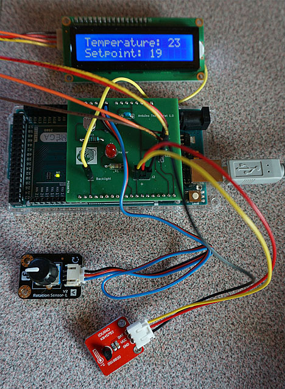

## Arduino thermostat shield.

To illustrate through practice the different concepts of embedded programming in C/C++, I developed an Arduino shield with the following interfaces :

- An I2C LCD.
- A DS18B20 temperature sensor.
- A LDR.
- A potentiometer.
- A LED.

