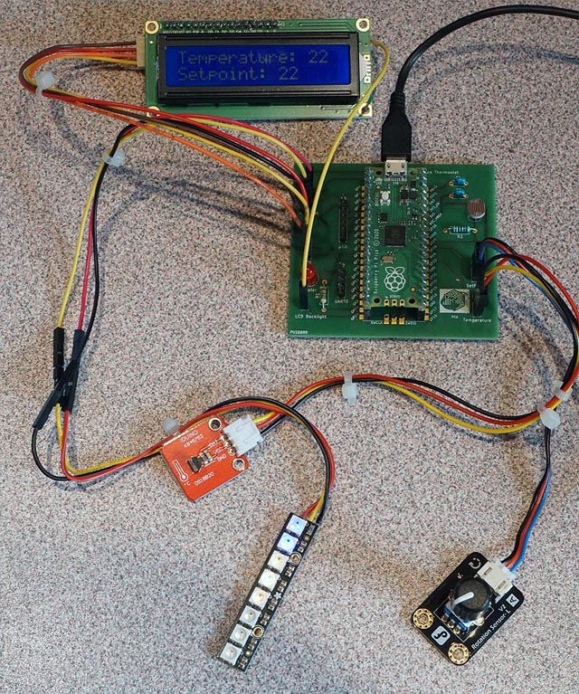

## Raspberry Pi Pico thermostat experimentation board.

To teach how to use MicroPython with several peripherals, I developped an board with the following interfaces :

- RP2040 Pico socket.
- Thermostat interfaces:
  - An I2C LCD.
  - A DS18B20 temperature sensor.
  - A LDR.
  - A potentiometer.
  - A LED.
- A Neopixel header
- An UART 0 Header
- A µSD Header

