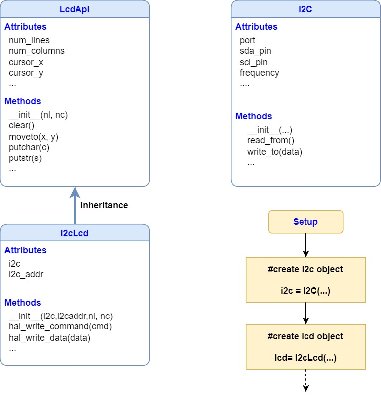

## Object orientation.

This is a first introduction on how to transform an embedded peripheral device in a software object. 

We use the [joy_it I2C LCD module](https://joy-it.net/en/products/SBC-LCD16x2) as an example.

The description of the LCD object is the following:

A brief reminder of the object oriented programming in Python with a reference to a web tutorial is given in the [OOprog.pdf](OOprog.pdf) file.

A basic description of the I2C protocol is also given: [I2C.pdf](I2C.pdf).

The file used for the LCD modules are [here](https://github.com/pcamus/Educational-boards/tree/main/Pico_therm/software/therm_loop_v1).
